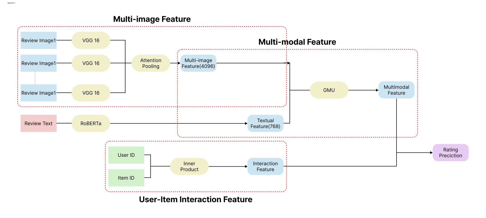

<div align="center">

# PRISM

**P**redicting **R**eview ratings with **I**mage-aware **S**equential **M**ultimodal fusion

멀티모달 리뷰 평점 예측 · 한성대학교 빅데이터프로그래밍 산학협력 프로젝트

[](https://github.com/2026-bigdata-programming/PRISM)
[](https://www.python.org/)
[](https://www.tensorflow.org/)

</div>

---

## 소개

**PRISM**은 Amazon Reviews 데이터를 활용해, 리뷰 **텍스트**, **다중 이미지**, **사용자·상품 협업 신호**를 함께 융합하는 멀티모달 평점 예측 모델입니다.

기존 리뷰 기반 추천 연구는 텍스트나 user–item 상호작용에 치중하거나, 리뷰당 **한 장의 이미지**만 다루는 경우가 많습니다. PRISM은 **한 리뷰에 여러 장이 첨부된 이미지**를 Attention으로 가중 요약하고, RoBERTa 텍스트 특징과 **GMU(Gated Multimodal Unit)** 로 융합한 뒤, 행렬분해 기반 상호작용 벡터와 결합해 평점을 예측합니다.

---

## 모델 아키텍처

<p align="center">
  
</p>

<p align="center">
  <sub>Review Image 1..N → VGG-16 → Attention Pooling · Review Text → RoBERTa · User×Item MF → GMU → MLP → Rating</sub>
</p>

| 구성 요소 | 설명 |
| --- | --- |
| **텍스트** | 사전학습 RoBERTa로 리뷰 본문 임베딩 (768차원) |
| **이미지** | 리뷰당 가변 개수 이미지 → VGG-16 `fc2` (4096차원) → **Masked Attention Pooling** |
| **협업** | User / Item ID 임베딩의 Hadamard 곱 → Interaction feature (64차원) |
| **융합** | GMU로 텍스트·이미지 게이팅 융합 (768차원) 후 MLP 회귀 (MSE + Adam + Early Stopping) |

---

## 주요 레포지토리

| 레포 | 설명 |
| --- | --- |
| [**PRISM**](https://github.com/2026-bigdata-programming/PRISM) | 모델 정의, 전처리 파이프라인, 학습·평가 (`main.py`) |

### 실행 요약

```bash
git clone https://github.com/2026-bigdata-programming/PRISM.git
cd PRISM
pip install -r requirements.txt
python main.py
```

데이터 준비·하이퍼파라미터·절제연구 설정은 [PRISM README](https://github.com/2026-bigdata-programming/PRISM#readme)를 참고하세요.

---

## 절제연구 (Ablation)

동일 train/val/test 분할(7:1:2)과 하이퍼파라미터로 아래 설정을 비교합니다.

| 설정 | 설명 |
| --- | --- |
| **Text-only** | RoBERTa + MF |
| **First Image** | PRISM 구조, Attention 대신 첫 non-zero 이미지 1장 |
| **Mean / Max Pool** | 다중 이미지 고정 풀링 + MF (image-only) |
| **Attention (image-only)** | 다중 이미지 Attention + MF |
| **PRISM Full** | Text + Multi-image Attention + GMU + MF |

평가 지표: **MAE · MSE · RMSE · MAPE**

---

## 팀원

| 이름 | GitHub |
| --- | --- |
| 박세웅 | [@hardwoong](https://github.com/hardwoong) |
| 김준용 | [@ggamnunq](https://github.com/ggamnunq) |
| 김준호 | [@kjhh2605](https://github.com/kjhh2605) |
| 윤예진 | [@nyun-nye](https://github.com/nyun-nye) |
| 이재원 | [@jwon0523](https://github.com/jwon0523) |

---

## 기술 스택

**ML / DL** · TensorFlow · PyTorch · Hugging Face Transformers (RoBERTa) · VGG-16  
**Data** · pandas · NumPy · scikit-learn · Parquet  
**Infra** · RunPod · Amazon Reviews 2023

---

## 연락

- 이슈·버그·협업 문의: [PRISM Issues](https://github.com/2026-bigdata-programming/PRISM/issues)
- 모델 상세 문서: [github.com/2026-bigdata-programming/PRISM](https://github.com/2026-bigdata-programming/PRISM)

---

<div align="center">

**PRISM** · Hansung University · Big Data Programming (2026)

</div>
